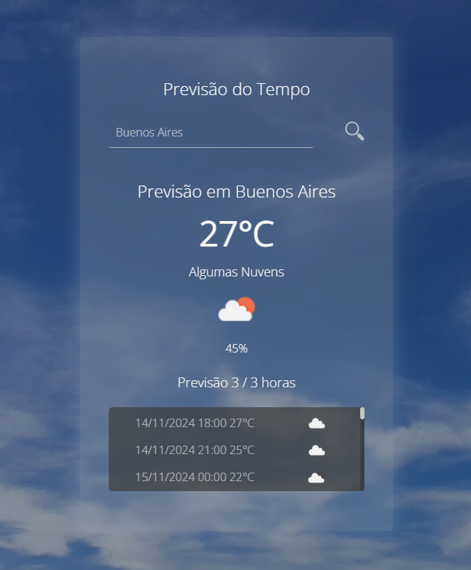

# Previsão do Tempo - Projeto de Algoritmo e Lógica de Programação



Este projeto foi desenvolvido como parte da matéria de Algoritmo e Lógica de Programação no primeiro semestre da faculdade. O objetivo principal foi aplicar conhecimentos básicos de HTML, CSS e JavaScript para construir uma aplicação web que consome a API OpenWeatherMap e exibe informações climáticas para a localização atual do usuário ou para qualquer cidade pesquisada.

## Funcionalidades

A aplicação possui duas funcionalidades principais: detectar automaticamente a localização do usuário para exibir o clima ou permitir a busca manual por uma cidade específica.

1. Detecção Automática da Localização

Ao carregar a página, a aplicação utiliza a API de geolocalização do navegador para detectar a localização atual do usuário (caso a permissão seja concedida).
Com as coordenadas (latitude e longitude) obtidas, a aplicação faz uma requisição para a API OpenWeatherMap para exibir as informações climáticas e a previsão das próximas 48 horas.
As informações exibidas incluem:
Nome da cidade
Temperatura atual
Condição climática (e descrição)
Ícone representando o clima
Umidade relativa do ar
A imagem de fundo da aplicação também é alterada automaticamente para corresponder à condição climática atual (ex.: céu limpo, nublado, chuva).

2. Busca por Cidade

Além da detecção automática, o usuário pode pesquisar qualquer cidade digitando o nome no campo de busca.
Ao inserir o nome da cidade, a aplicação faz uma nova requisição à API para exibir as informações climáticas e a previsão para os próximos dias da cidade escolhida.
As informações exibidas são semelhantes às da localização automática:
Nome da cidade
Temperatura atual
Condição climática
Ícone representando o clima
Umidade relativa do ar
A funcionalidade de busca por cidade permite ao usuário visualizar as condições climáticas em qualquer lugar do mundo.

## Tecnologias Utilizadas

- **HTML**: estrutura básica do projeto e elementos para exibir as informações.
- **CSS**: estilização da interface, como layout e apresentação das informações.
- **JavaScript**: lógica do projeto, incluindo chamadas à API de geolocalização e OpenWeatherMap, além de manipulação do DOM para exibir dados.
- **API OpenWeatherMap**: fonte dos dados climáticos, fornecendo informações sobre o clima atual e previsão por coordenadas ou nome de cidade.

## Objetivo do Projeto
Este projeto foi desenvolvido com o intuito de:

Praticar conceitos básicos de algoritmo e lógica de programação.
Aprender a consumir e manipular dados de uma API.
Desenvolver habilidades iniciais de desenvolvimento web, como manipulação do DOM e estilização de elementos com CSS.
Como Usar
Carregamento Automático: Ao abrir a página, conceda permissão para que o navegador acesse a sua localização e veja o clima atual da sua área.
Busca Manual: Digite o nome de qualquer cidade no campo de pesquisa e clique no botão de busca para ver as condições climáticas da cidade escolhida.
Observações
A detecção automática de localização requer permissão do usuário. Caso a permissão seja negada, somente a busca manual estará disponível.
Este projeto é uma aplicação básica e foi desenvolvido para fins educativos. Como resultado, algumas funcionalidades e otimizações podem não estar presentes.
Pré-requisitos
Para que a aplicação funcione corretamente, é necessário ter acesso à internet, pois os dados climáticos são carregados a partir da API OpenWeatherMap.

## Como Executar o Projeto

1. Clone o repositório:
  ```bash
  git clone https://github.com/RaphaelBOL/app_previsao_do_tempo
  ```

2. Navegue até a pasta do projeto
  ```bash
  cd app_previsao_do_tempo
  ```

3. Abra o arquivo index.html em um navegador para visualizar o site.

## Autor

Desenvolvido por Raphael como parte de estudos em desenvolvimento web.

## Licença

Este projeto é de uso livre para fins de aprendizado. Se usar partes deste projeto, por favor, dê os devidos créditos.